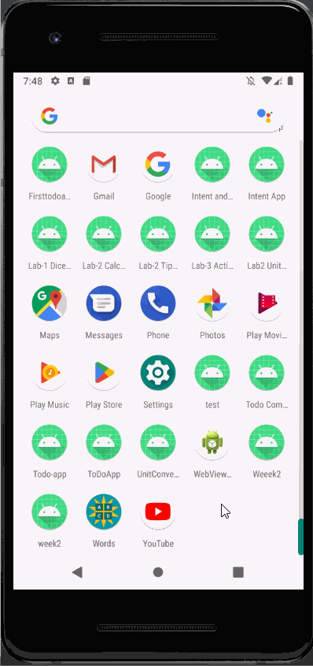
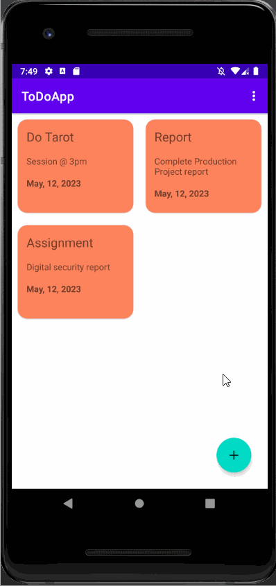
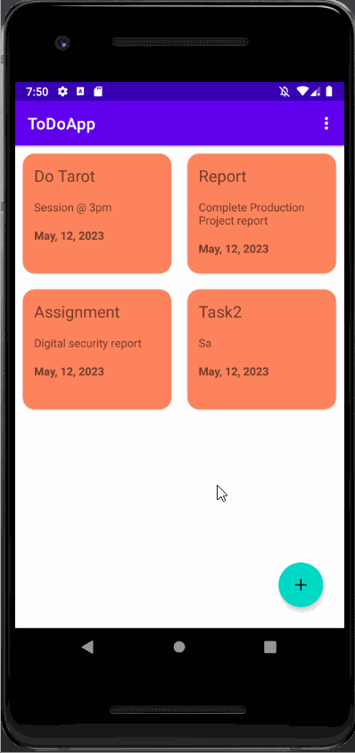
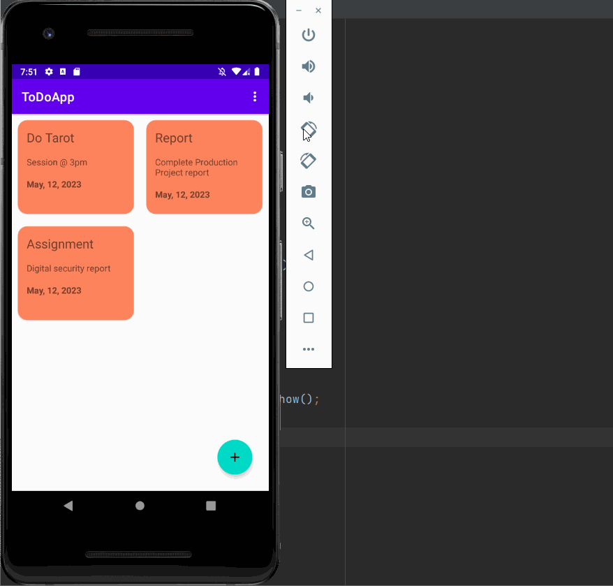
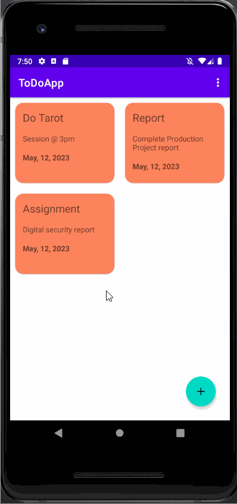
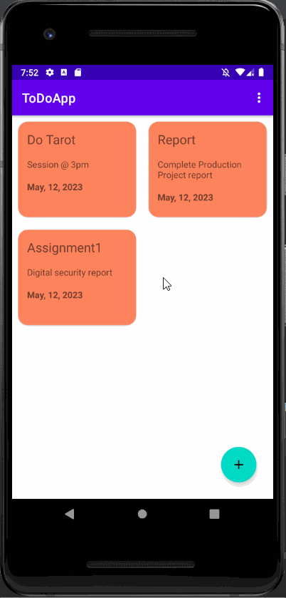

TODO APP 
Opening the app we get a welcome screen then the main activity.It already has some data saved before 

   

INSERT 
Inserting new task by clicking the add button in the bottom right.Automatically adds date. 
   

EDIT 
Editing existing task by clicking any task.Opens a new Update activity class which is already populated with revious data. 
   

DELETE 
Deleteing task by clicking the task you want to delete.Opens the update activity, at the menu top right there is a delete icon .After pressing the icon it gives us an confirmation dialogue box. 
   

ROTATE 
Rotating the screen and everything still works perfectly. 
   

SORT BY TITLE 
Arranging the tasks in ascending order accordin to their title.Added a custom main menu where sort option is available 
   

DELETE ALL 
Deleting all the tasks in the app.Added a custom main menu where delete all option is available. 
   